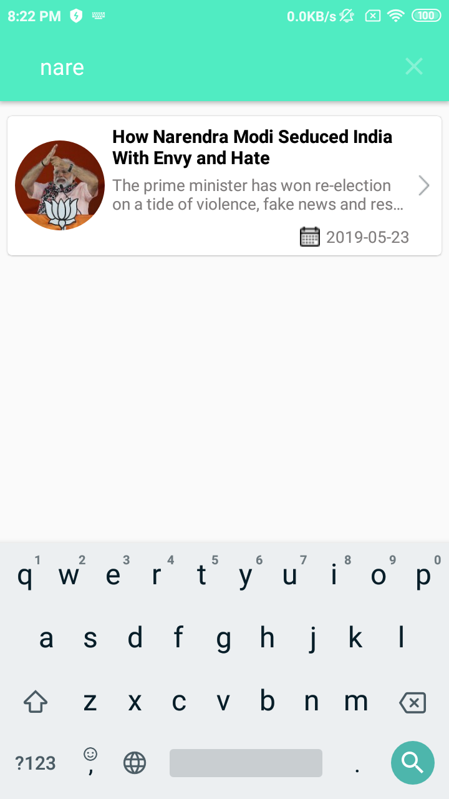

<H1>Sample Project with New York time api with MVVM, RxJava and Retrofit </H1>

<H3>Key Features</H3>
<li> Most Popular News List</li>
<li> Search News by title </li>
<li> Search News by date </li>

<H3>Key Areas</H3>
<li> MVVM Architectural pattern </li>
<li> Best Practices </li> 
<li> API Call and Parsing of data </li> 
<li> UI Implementation </li>
<li> Unit test demonstration using JUnit and Mockito </li>

  Application code is written to demonstrate the coding pattern using MVVM design pattern in Android. The application is showing the popular news section using New York times api.

The complete application is built based on the MVVM architectural pattern. The application follows the best coding practices.

<H1> Screenshots </H1>
 
<H2><li> Most Popular News List</li> <H2>

 
<H2><li> News Details Page </li> <H2>

 
<H2><li> Search by Title</li> <H2>

 
<H2> Programming Practices Followed </H2>

1) Android Architectural Components 
2) Dagger 2 for Dependency Injection 
3) MVVM 
4) Retrofit with Okhttp  
5) JUnit and Mockito for Unit testing 
